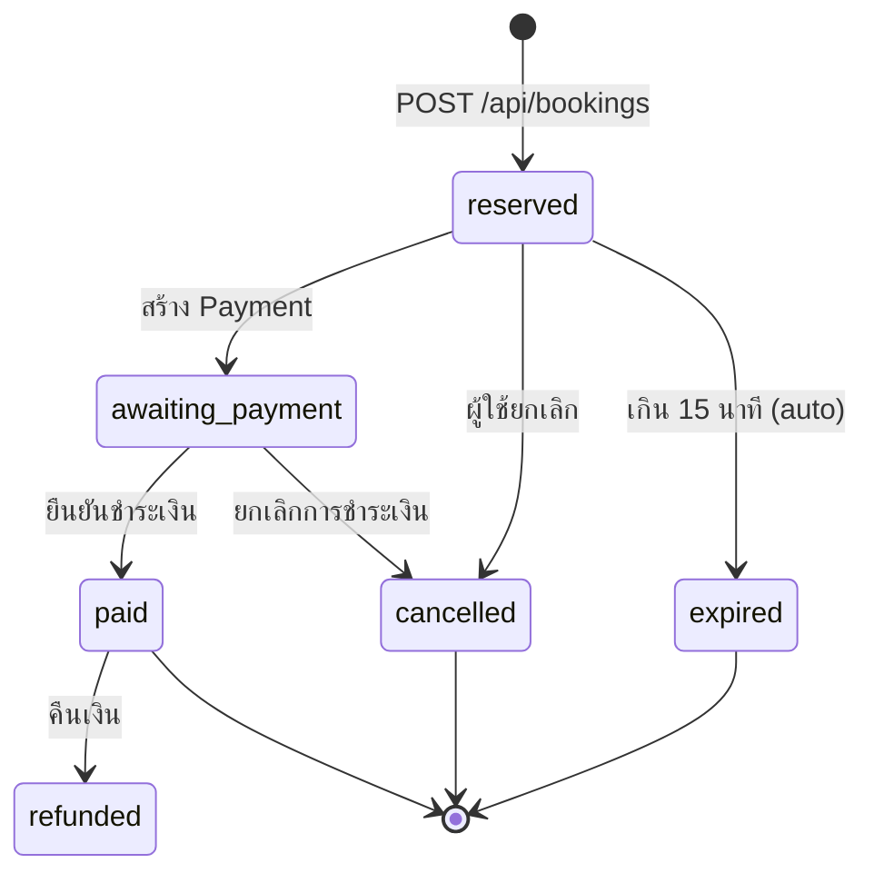
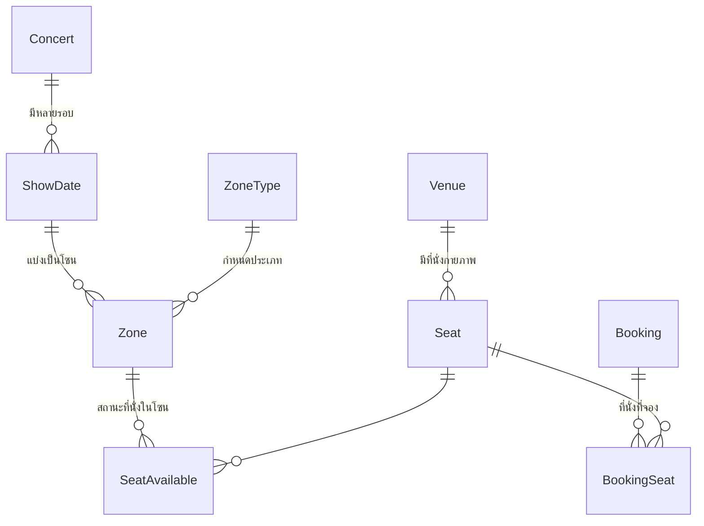
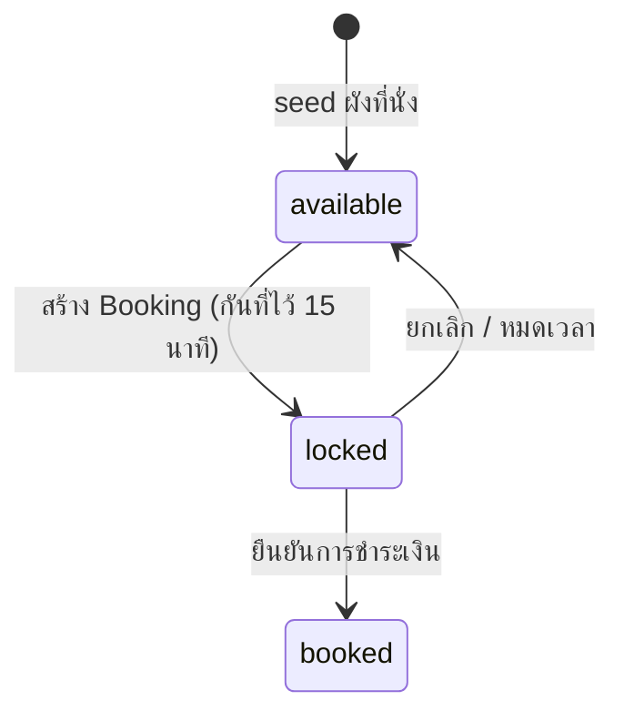
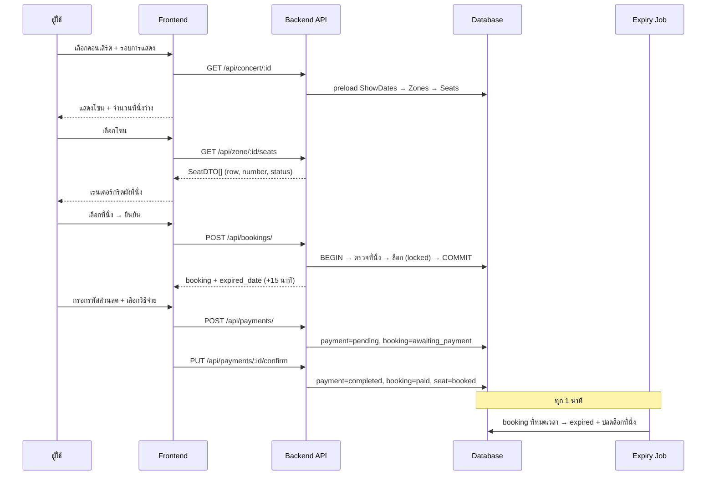

# Course Project (System Analysis and Design) — ระบบจองบัตรคอนเสิร์ตออนไลน์

ระบบจองบัตรคอนเสิร์ตแบบครบวงจร ประกอบด้วยฝั่งผู้ใช้ทั่วไป (เลือกคอนเสิร์ต → เลือกโซน → เลือกที่นั่ง → ชำระเงิน) และฝั่งผู้จัดงาน (Organizer) สำหรับจัดการคอนเสิร์ตและโปรโมชั่น

> เอกสารฉบับนี้เน้นอธิบาย **ส่วนที่ผมรับผิดชอบ** เป็นหลัก ได้แก่
> 1. [ระบบกดบัตร (Booking)](#1-ระบบกดบัตร-booking)
> 2. [ระบบจัดการผังที่นั่ง (Seat & Zone Management)](#2-ระบบจัดการผังที่นั่ง-seat--zone-management)
> 3. [ระบบโปรโมชั่น (Promotion)](#3-ระบบโปรโมชั่น-promotion)

---

## Tech Stack

| ส่วน | เทคโนโลยี |
|---|---|
| Backend | Go 1.x, Gin (HTTP framework), GORM (ORM) |
| Database | SQLite (`backend/sa.db`) |
| Frontend | React 18 + TypeScript, Vite, Ant Design, TailwindCSS, Axios |
| อื่น ๆ | JWT Auth, PromptPay QR (`promptpay-qr`, `qrcode`) |

## โครงสร้างโปรเจกต์

```
SA-Project/
├── backend/
│   ├── main.go                      # entry point + ลงทะเบียน route + start background job
│   ├── connection/
│   │   ├── db.go                    # เชื่อมต่อ SQLite, AutoMigrate, seed master data
│   │   └── seed.go                  # SeedSeats / SeedSeatAvailable (สร้างผังที่นั่ง)
│   ├── entity/                      # GORM models ทั้งหมด
│   ├── controllers/
│   │   ├── booking/                 # booking.go, seat.go, concert.go
│   │   ├── payment/                 # payment.go
│   │   └── promotion/               # promotion.go, uploadposter.go
│   ├── services/                    # business logic layer
│   │   ├── booking.go               # ตรรกะการจอง + ผังที่นั่ง
│   │   ├── booking_expiry.go        # background job หมดเวลาการจอง
│   │   ├── payment.go               # ตรรกะการชำระเงิน
│   │   └── Promotion.go             # ตรรกะโปรโมชั่น
│   ├── routes/booking.go            # รวม route ของ booking / zone / payment
│   └── uploads/                     # ไฟล์โปสเตอร์ที่อัปโหลด
└── frontend/
    └── src/
        ├── pages/booking/           # select-zone, select-seat, BookingDetail
        ├── pages/payment/           # หน้าชำระเงิน + PromptPay QR
        ├── pages/promotion/         # หน้าจัดการโปรโมชั่น (list/add/edit)
        ├── interface/               # TypeScript types
        └── services/https/index.ts  # API client layer
```

## การติดตั้งและรัน

### Backend
```bash
cd backend
go mod download
go run main.go
# Server running on http://localhost:8000
```
เมื่อรันครั้งแรก ระบบจะ `AutoMigrate` ตารางทั้งหมด, seed master data (Gender, PromotionType, ZoneType) และ seed ผังที่นั่งอัตโนมัติ

### Frontend
```bash
cd frontend
npm install
npm run dev
# http://localhost:5173
```
> Backend เปิด CORS ให้เฉพาะ `http://localhost:5173` (ตั้งค่าใน `backend/main.go`)

---

# ส่วนที่ผมรับผิดชอบ

## 1. ระบบกดบัตร (Booking)

หัวใจของระบบ อยู่ที่ `backend/services/booking.go`, `backend/controllers/booking/booking.go` และ `backend/services/booking_expiry.go`

### 1.1 แนวคิดหลัก

ระบบรองรับโซน 2 ประเภทที่มีตรรกะการจองต่างกันโดยสิ้นเชิง:

| | **Seating Zone** (โซนมีที่นั่ง) | **Standing Zone** (โซนยืน) |
|---|---|---|
| การเลือก | ผู้ใช้เลือกที่นั่งเจาะจงจากผัง (`seat_ids`) | ไม่เลือกที่นั่ง ระบบออก **queue number** ให้ |
| การตรวจสอบ | ตรวจทีละที่นั่งว่าสถานะ `available` หรือไม่ | ตรวจว่าจำนวนที่จองแล้วยังไม่เกิน `capacity` |
| ผลลัพธ์ | ล็อกที่นั่งเป็น `locked` + บันทึกลง `booking_seats` | ได้ `queue_number = MAX(queue) + 1` |
| Response | มี field `seats` | มี field `queue_number` |

### 1.2 การจัดการเวลา (Seat Hold 15 นาที)

เมื่อสร้างการจอง ระบบจะกำหนด `ExpiredDate = time.Now().Add(15 * time.Minute)` เพื่อกันที่นั่งไว้ให้ผู้ใช้ชำระเงิน หากไม่ชำระภายในเวลา ระบบจะปล่อยที่นั่งคืนอัตโนมัติ

**Background Job** (`services/booking_expiry.go`) ถูกสั่งให้ทำงานตั้งแต่ `main.go` เริ่มระบบ:

```go
bookingExpiryService := services.NewBookingExpiryService()
bookingExpiryService.StartExpiryChecker()
```

ตัว checker ทำงานเป็น goroutine ที่มี `time.Ticker` เดินทุก 1 นาที เพื่อ:
1. ค้นหา booking ที่ `expired_date < NOW()` และยังมีสถานะ `reserved`
2. อัปเดตสถานะเป็น `expired`
3. ปลดล็อกที่นั่งที่ผูกกับ booking นั้นกลับเป็น `available`

มี `StopExpiryChecker()` สำหรับหยุด goroutine ผ่าน channel และ `ManualExpireBookings()` สำหรับเรียกเคลียร์เองตอนทดสอบ

### 1.3 ความปลอดภัยของข้อมูล (Transaction)

ทุกขั้นตอนของ `CreateBooking` ทำงานอยู่ใน **database transaction** เดียว — ตรวจ zone → ตรวจ showdate → ตรวจ user → ตรวจ/ล็อกที่นั่ง → สร้าง booking → สร้าง booking_seats หากขั้นตอนใดล้มเหลวจะ `tx.Rollback()` ทั้งหมด เพื่อกันปัญหา **ที่นั่งถูกล็อกทิ้งไว้โดยไม่มี booking** และลดโอกาสเกิด double booking จากการกดพร้อมกัน

### 1.4 สถานะการจอง (Booking Status)



| สถานะ | ความหมาย |
|---|---|
| `reserved` | จองแล้ว กำลังกันที่นั่งไว้ รอชำระเงิน |
| `awaiting_payment` | สร้างรายการชำระเงินแล้ว รอยืนยัน |
| `paid` | ชำระเงินสำเร็จ ที่นั่งถูกเปลี่ยนเป็น `booked` |
| `cancelled` | ยกเลิก ที่นั่งถูกปลดล็อก |
| `expired` | หมดเวลา ที่นั่งถูกปลดล็อกอัตโนมัติ |
| `refunded` | คืนเงินแล้ว |

`UpdateBookingStatus()` จะปลดล็อกที่นั่งกลับเป็น `available` โดยอัตโนมัติเมื่อสถานะเปลี่ยนเป็น `cancelled` หรือ `expired`

### 1.5 API — Booking

Base: `http://localhost:8000`

| Method | Endpoint | คำอธิบาย |
|---|---|---|
| `POST` | `/api/bookings/` | สร้างการจอง (รองรับทั้ง Seating และ Standing) |
| `GET` | `/api/bookings/:id` | ดึงรายละเอียดการจองพร้อมรายการที่นั่ง |
| `PUT` | `/api/bookings/:id/status` | อัปเดตสถานะการจอง (validate ค่าที่อนุญาต) |
| `DELETE` | `/api/bookings/:id` | ยกเลิกการจอง + ปลดล็อกที่นั่ง |
| `GET` | `/api/bookings/user/:user_id` | ดึงประวัติการจองทั้งหมดของผู้ใช้ (เรียงใหม่→เก่า) |

**ตัวอย่าง — จอง Seating Zone**
```http
POST /api/bookings/
Content-Type: application/json

{
  "user_id": 1,
  "showdate_id": 1,
  "zone_id": 1,
  "seat_ids": [1, 2],
  "total_price": 2000
}
```
```json
{
  "message": "Booking created successfully",
  "data": {
    "id": 1,
    "user_id": 1,
    "showdate_id": 1,
    "zone_id": 1,
    "total_price": 2000,
    "booking_date": "2026-01-18T10:00:00Z",
    "expired_date": "2026-01-18T10:15:00Z",
    "status": "reserved",
    "seats": [1, 2]
  }
}
```

**ตัวอย่าง — จอง Standing Zone** (ไม่ต้องส่ง `seat_ids`) จะได้ `queue_number` กลับมาแทน `seats`

**Error ที่ระบบตรวจจับ:** `zone not found`, `showdate not found`, `user not found`, `seat IDs are required for seating zone`, `seat not found in zone`, `seat is not available`, `zone is full`, `unsupported zone type`

### 1.6 หน้าจอฝั่ง Frontend

| หน้า | ไฟล์ | หน้าที่ |
|---|---|---|
| เลือกโซน | `pages/booking/select-zone/index.tsx` | แสดงผังรวม (chart image) + รายการโซนพร้อมราคาและจำนวนที่นั่งว่าง เลือกรอบการแสดง (show date) |
| เลือกที่นั่ง | `pages/booking/select-seat/index.tsx` | เรนเดอร์กริดที่นั่งจริงจาก API แยกแถว/หมายเลข ระบายสีตามสถานะ |
| สรุปการจอง | `pages/booking/BookingDetail/index.tsx` | สรุปรายการ + ช่องกรอกรหัสส่วนลด + นับเวลาถอยหลัง |
| ชำระเงิน | `pages/payment/index.tsx` | เลือกวิธีจ่าย, PromptPay QR, อัปโหลดสลิป + timer |

หน้า Select Zone คำนวณจำนวนที่นั่งว่างเองจาก relation `seat_available` ที่ preload มากับ concert (`calcAvailableSeats`) และแสดงสถานะ Available / Sold out ด้วยสี

---

## 2. ระบบจัดการผังที่นั่ง (Seat & Zone Management)

### 2.1 โครงสร้างข้อมูล

ผังที่นั่งออกแบบให้ **แยกที่นั่งกายภาพออกจากสถานะการขาย** เพื่อให้สถานที่เดียวกัน (Venue) นำผังกลับมาใช้ซ้ำได้ทุกรอบการแสดง



| Entity | บทบาท |
|---|---|
| `Seat` | ที่นั่งกายภาพของสถานที่ — `venue_id` + `seat_code` (เช่น `A1`) มี unique index ร่วมกัน กันการสร้างซ้ำ |
| `Zone` | โซนของรอบการแสดง — ผูก `show_date_id`, `venue_id`, `zone_type_id`, `zone_price`, `capacity` |
| `ZoneType` | `Seating` หรือ `Standing` |
| `SeatAvailable` | **ตารางกลาง** ที่บอกว่าที่นั่งใดอยู่ในโซนใดและมีสถานะอะไร — unique index `(zone_id, seat_id)` |
| `BookingSeat` | บันทึกว่าการจองใดจับจองที่นั่งใด — unique index `(booking_id, seat_id)` |

### 2.2 สถานะที่นั่ง



| สถานะ | ความหมาย | สีบน UI |
|---|---|---|
| `available` | ว่าง เลือกได้ | ปกติ |
| `locked` | ถูกกันไว้ระหว่างรอชำระเงิน | เลือกไม่ได้ |
| `booked` | ขายแล้ว | เลือกไม่ได้ |

### 2.3 การสร้างผังที่นั่ง (Seeding)

`connection/seed.go` มีฟังก์ชัน 2 ตัว:

```go
// สร้างที่นั่งกายภาพ: 19 แถว (A–S) แถวละ 15 ที่ = 285 ที่นั่ง
SeedSeats(1, []string{"A","B","C", ... ,"S"}, 15)
```
- ประกอบรหัสที่นั่งเป็น `A1`, `A2`, ..., `S15`
- ใช้ `clause.OnConflict{DoNothing: true}` เพื่อให้รันซ้ำได้โดยไม่สร้างข้อมูลซ้ำ (idempotent)

```go
SeedSeatAvailable(db)  // ผูกที่นั่งทั้งหมดเข้ากับโซน แล้วตั้งสถานะเริ่มต้นเป็น "available"
```
- ใช้ `OnConflict` บนคู่คอลัมน์ `(zone_id, seat_id)` เพื่อกันการผูกซ้ำ

### 2.4 การอ่านผังที่นั่งสำหรับ Frontend

Backend ไม่ได้ส่ง raw entity ให้ frontend ตรง ๆ แต่แปลงเป็น **`SeatDTO`** ที่พร้อมเรนเดอร์เป็นกริด:

```go
type SeatDTO struct {
    ID     uint   `json:"id"`      // seat_id
    Code   string `json:"code"`    // "A10"
    Row    string `json:"row"`     // "A"
    Number int    `json:"number"`  // 10
    Status string `json:"status"`  // available | locked | booked
}
```

ตรรกะสำคัญใน service layer:
- **`splitSeatCode()`** — ใช้ regex `^([A-Za-z]+)(\d+)$` แยกรหัส `A10` ออกเป็นแถว `A` และหมายเลข `10` มี fallback กรณีรหัสไม่ตรงรูปแบบ (ถือทั้งก้อนเป็นชื่อแถว)
- **`convertToSeatDTO()`** — แปลง entity → DTO พร้อม normalize รหัสให้เป็นตัวพิมพ์ใหญ่และตัดช่องว่าง
- **`sortSeats()`** — เรียงตามแถวก่อน แล้วจึงเรียงตามหมายเลขที่นั่ง **แบบตัวเลข** (ไม่ใช่ string) ทำให้ `A2` มาก่อน `A10` อย่างถูกต้อง

ฝั่ง frontend (`select-seat/index.tsx`) รับ array นี้ไปเข้าฟังก์ชัน `buildSeatGrid()` ซึ่ง group ตาม `row` เป็น `Map` แล้วเรนเดอร์เป็นตารางที่นั่ง พร้อม `normalizeStatus()` ที่แปลงค่าสถานะจาก API ให้เป็น union type ที่ปลอดภัย

### 2.5 API — Seat & Zone

| Method | Endpoint | คำอธิบาย |
|---|---|---|
| `GET` | `/api/zone/:id/seats` | ดึงผังที่นั่งทั้งโซน (SeatDTO พร้อม row/number/status) — ใช้เรนเดอร์กริด |
| `GET` | `/api/zones/:zone_id/seats/available` | ดึงเฉพาะที่นั่งที่ยังว่าง |
| `GET` | `/api/zones/:zone_id/info` | ข้อมูลโซน + สรุปจำนวนที่นั่งแยกตามสถานะ |

**ตัวอย่าง — `GET /api/zones/1/info`**
```json
{
  "data": {
    "id": 1,
    "zone_name": "VIP Zone",
    "zone_price": 2000,
    "capacity": 100,
    "zone_type": "Seating",
    "available_seats": 50,
    "locked_seats": 30,
    "booked_seats": 20
  }
}
```
Query นี้ใช้ `COUNT(CASE WHEN ...)` นับที่นั่งแยกตามสถานะในคำสั่งเดียว แทนการยิงหลาย query

---

## 3. ระบบโปรโมชั่น (Promotion)

จัดการโดยผู้จัดงาน (Organizer) อยู่ที่ `controllers/promotion/` และ `services/Promotion.go`

### 3.1 โครงสร้างข้อมูล

```go
type Promotion struct {
    gorm.Model
    PromotionName   string     // ชื่อโปรโมชั่น
    Description     string     // รายละเอียด
    PromotionTypeId uint       // ประเภท
    PromotionCode   string     // รหัสส่วนลด
    Discount        int        // ส่วนลด (%)
    StartDate       time.Time  // วันเริ่ม
    EndDate         time.Time  // วันสิ้นสุด
    Limit           int        // จำนวนสิทธิ์ทั้งหมด
    UsedCount       int        // จำนวนที่ใช้ไปแล้ว
    Status          string     // active | inactive
    UserID          uint       // ผู้สร้าง (Organizer)
    ConcertID       uint       // ผูกกับคอนเสิร์ต
    Poster          string     // URL โปสเตอร์
}
```

**ประเภทโปรโมชั่น** (seed ไว้ใน `connection/db.go`): `Early Bird`, `Code`, `Concert`

### 3.2 ฟีเจอร์

- **CRUD ครบวงจร** — สร้าง / อ่าน / แก้ไข / ลบ โปรโมชั่น
- **Preload relations** — ทุก endpoint ที่คืนโปรโมชั่นจะ preload `PromotionType`, `User` (ผู้สร้าง) และ `Concert` ให้ครบ เพื่อให้ frontend แสดงตารางได้โดยไม่ต้องยิง API เพิ่ม
- **คืนข้อมูลหลังแก้ไข** — `UpdatePromotion` จะ query ข้อมูลใหม่พร้อม relations กลับไปให้ ทำให้ตารางฝั่ง UI อัปเดตทันทีโดยไม่ต้อง refetch
- **Hard delete** — ใช้ `Unscoped().Delete()` ลบออกจริง (ไม่ใช่ soft delete ของ GORM) เพื่อไม่ให้รหัสส่วนลดเก่าค้างในระบบ
- **อัปโหลดโปสเตอร์** — รับไฟล์ผ่าน `multipart/form-data` ตั้งชื่อไฟล์ใหม่ด้วย `UnixNano` กันชื่อซ้ำ สร้างโฟลเดอร์ `uploads/` อัตโนมัติถ้ายังไม่มี แล้วคืน URL กลับไป (เสิร์ฟผ่าน `r.Static("/uploads", "./uploads")`)

### 3.3 API — Promotion

| Method | Endpoint | คำอธิบาย |
|---|---|---|
| `POST` | `/organizer/promotion/add` | สร้างโปรโมชั่นใหม่ |
| `GET` | `/organizer/promotion` | ดึงโปรโมชั่นทั้งหมด (พร้อม relations) |
| `GET` | `/organizer/promotion/:id` | ดึงโปรโมชั่นตาม ID |
| `PUT` | `/organizer/promotion/:id` | แก้ไขโปรโมชั่น (คืนข้อมูลใหม่พร้อม relations) |
| `DELETE` | `/organizer/promotion/:id` | ลบโปรโมชั่น (hard delete) |
| `GET` | `/api/promotions` | ดึงรายการประเภทโปรโมชั่นทั้งหมด |
| `POST` | `/api/upload` | อัปโหลดรูปโปสเตอร์ (คืน `{ success, data: { url } }`) |

### 3.4 หน้าจอฝั่ง Frontend

| หน้า | ไฟล์ |
|---|---|
| รายการโปรโมชั่น (ตาราง + ค้นหา + ลบพร้อม confirm dialog) | `pages/promotion/index.tsx` |
| เพิ่มโปรโมชั่น | `pages/promotion/add/index.tsx` |
| แก้ไขโปรโมชั่น (Modal) | `pages/promotion/edit/index.tsx` |

เรียก API ผ่าน API client layer ที่ `services/https/index.ts`:
```ts
export const promotionAPI = {
  create:      (data)     => Post(`${ORGANIZER_API_URL}/promotion/add`, data),
  getAll:      ()         => Get(`${ORGANIZER_API_URL}/promotion`),
  getById:     (id)       => Get(`${ORGANIZER_API_URL}/promotion/${id}`),
  update:      (id, data) => Update(`${ORGANIZER_API_URL}/promotion/${id}`, data),
  delete:      (id)       => Delete(`${ORGANIZER_API_URL}/promotion/${id}`),
  getAllTypes: ()         => Get(`${PUBLIC_API_URL}/promotions`, false),
};
```
Layer นี้ห่อ axios ไว้ พร้อมจัดการ 401 (เคลียร์ session แล้ว reload) และ Network Error ไว้ที่จุดเดียว

### 3.5 การเชื่อมกับการชำระเงิน

`Payment` มี `promotion_id` เป็น FK โดยตอนสร้างการชำระเงินจะส่ง `base_price`, `discount`, `total_price` มาพร้อมกัน ทำให้เก็บ **หลักฐานราคาก่อน/หลังส่วนลด ณ เวลาที่จ่ายจริง** ไว้ในรายการชำระเงิน (ไม่ต้องคำนวณย้อนหลังจากโปรโมชั่นที่อาจถูกแก้ไขภายหลัง)

---

## 4. การชำระเงิน (ส่วนที่เชื่อมต่อกับระบบจอง)

`services/payment.go` ทำงานร่วมกับระบบจองโดยตรง:

- **`CreatePayment`** — ตรวจว่า booking ยังไม่หมดเวลา (`time.Now().After(booking.ExpiredDate)`) และยังไม่ถูกจ่ายไปแล้ว จากนั้นสร้าง payment สถานะ `pending` และผลัก booking เป็น `awaiting_payment`
- **`ConfirmPayment`** — อัปเดต payment เป็น `completed`, ผลัก booking เป็น `paid` และ **เปลี่ยนสถานะที่นั่งจาก `locked` → `booked`** สำหรับ Seating zone
- **`CancelPayment`** — กันไม่ให้ยกเลิก payment ที่ `completed` ไปแล้ว และผลัก booking เป็น `cancelled` (ซึ่งจะปลดล็อกที่นั่งอัตโนมัติ)

ทั้งหมดทำงานภายใต้ transaction เช่นเดียวกับระบบจอง

| Method | Endpoint | คำอธิบาย |
|---|---|---|
| `POST` | `/api/payments/` | สร้างรายการชำระเงิน |
| `PUT` | `/api/payments/:id/confirm` | ยืนยันการชำระเงิน |
| `GET` | `/api/payments/:id` | ดึงข้อมูลการชำระเงิน |
| `GET` | `/api/payments/booking/:booking_id` | ดึงการชำระเงินตาม Booking |
| `DELETE` | `/api/payments/:id` | ยกเลิกการชำระเงิน |

---

## 5. Flow การใช้งานทั้งหมด



---

## 6. การทดสอบ

ไฟล์สำหรับทดสอบอยู่ในโฟลเดอร์ `backend/`:

| ไฟล์ | ใช้ทำอะไร |
|---|---|
| `Booking_API_Tests.postman_collection.json` | Postman Collection ครอบคลุม Booking / Zone / Payment API |
| `test_booking_api.sh` | สคริปต์ทดสอบ end-to-end ผ่าน `curl` |
| `test_data_setup.sql` | SQL เตรียมข้อมูลทดสอบ (venue, concert, zone, seat, status) |
| `TESTING_GUIDE.md` | คู่มือการทดสอบทีละขั้น |
| `README_BOOKING.md` | เอกสาร API ของระบบจองแบบละเอียด |
| `examples/booking_examples.md` | ตัวอย่าง request/response |

```bash
cd backend
sqlite3 sa.db < test_data_setup.sql   # เตรียมข้อมูล
./test_booking_api.sh                 # รันทดสอบ
```

---

## 7. หมายเหตุ / งานที่ยังค้าง

- **`backend/services/booking.go` ยังคอมไพล์ไม่ผ่านในสถานะปัจจุบัน** — ไฟล์เวอร์ชันที่แก้ล่าสุดถูกเขียนทับด้วยตรรกะฝั่ง booking ทำให้ `SeatDTO`, `GetSeatsByZoneID()` และ constructor `NewBookingService()` แบบไม่รับ argument (ที่ `controllers/booking/seat.go` เรียกใช้) หายไป ต้องรวมโค้ดสองส่วนเข้าด้วยกัน:
  ```
  controllers\booking\seat.go:17: not enough arguments in call to services.NewBookingService
  controllers\booking\seat.go:32: h.bookingService.GetSeatsByZoneID undefined
  ```
  ทางแก้: นำฟังก์ชันจัดการผังที่นั่งจาก `git show HEAD:backend/services/booking.go` กลับมาไว้ในไฟล์เดียวกัน (หรือแยกเป็น `services/seat.go`) และปรับ `seat.go` ให้ส่ง `connection.DB()` เข้า constructor
- การนับ capacity ของ Standing zone ยัง join ผ่าน `show_date_id` ซึ่งจะนับรวมทุกโซนในรอบเดียวกัน ควรปรับให้ผูกกับ `zone_id` ของ booking โดยตรง
- `BookingDetail` และ `Payment` ฝั่ง frontend ยังใช้ mock data บางส่วน (`src/mock/`) ยังไม่ได้ต่อ API จริงครบทุกจุด
- ระบบยังไม่ได้ตรวจ `Limit` / `UsedCount` ของโปรโมชั่นตอนใช้งานจริง

---

## 8. สรุปสิ่งที่พัฒนา

| ระบบ | Backend | Frontend |
|---|---|---|
| **กดบัตร** | Booking service + controller, transaction, seat hold 15 นาที, background expiry job, state machine 6 สถานะ, 5 endpoints | หน้าเลือกโซน/เลือกที่นั่ง/สรุปการจอง พร้อม countdown timer |
| **ผังที่นั่ง** | Entity design (Seat / Zone / SeatAvailable / BookingSeat), seeding แบบ idempotent, SeatDTO + การแยกแถว-หมายเลขด้วย regex, การเรียงลำดับเชิงตัวเลข, 3 endpoints | เรนเดอร์กริดที่นั่งแบบไดนามิก แยกสีตามสถานะ |
| **โปรโมชั่น** | CRUD + preload relations, hard delete, upload โปสเตอร์, 7 endpoints | หน้าจัดการโปรโมชั่น (list/add/edit) + API client layer |
